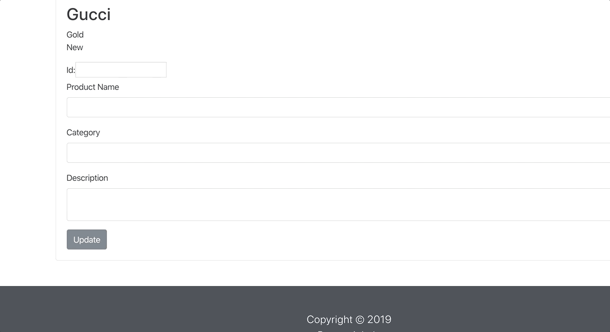
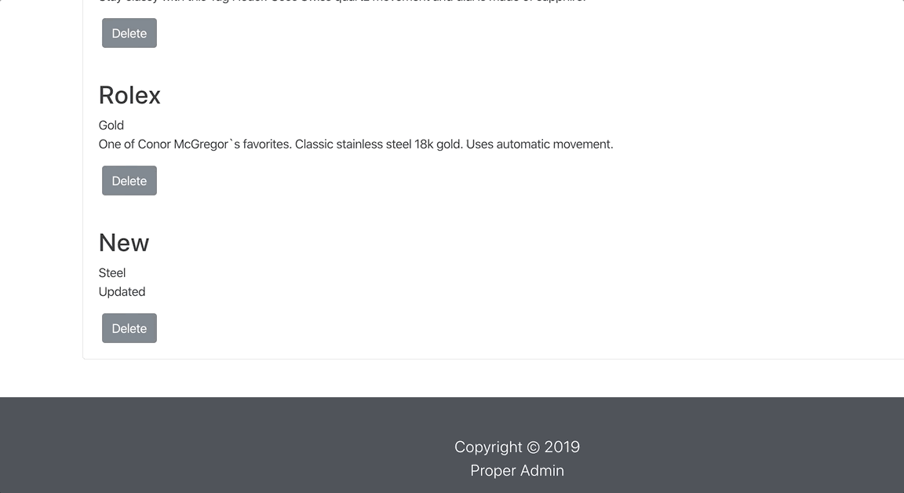

# ProperAdmin
This is our fourth phase of the e-commerce project. We created an admin app using React to create what the administrator would see on their side rather than what the client would see. This is a simple application that connects to our MySQL database using the C# server. It will just retrieve basic product information and allow for us to add, edit, view, and delete products.

### Usage

Start by cloning the repo 
`git clone https://github.com/bshin9/ProperAdmin`

Install needed modules in the root admin-app 
`npm install`

Run the app 
`npm start`

Make sure to install the C# extension if you're using VSCode 

Next, go into the ProductsApi through another terminal and run the server 
`dotnet run`

### Functional Diagram

### CRUD METHOD

#### ADD

#### UPDATE

#### DELETE

### Author
Brian Shin

### LICENSE
[MIT](https://github.com/bshin9/ProperAdmin/blob/master/LICENSE)
